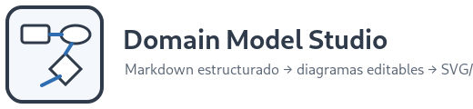
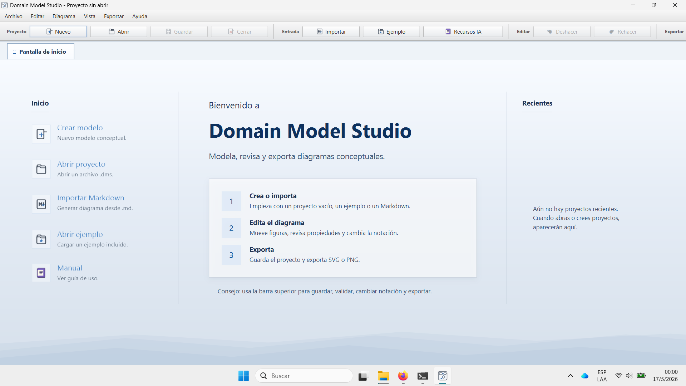
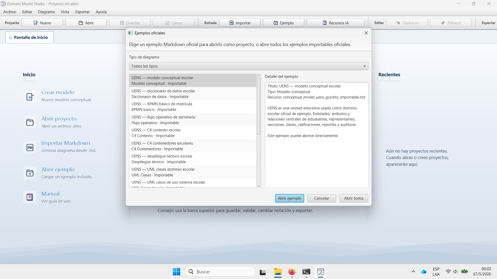
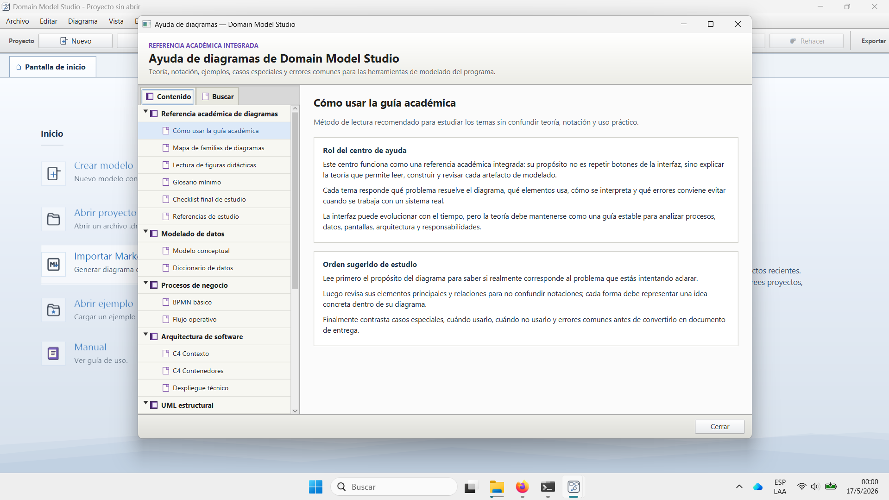
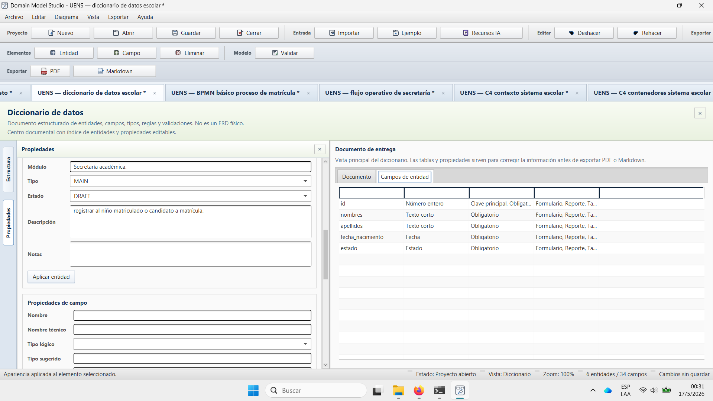
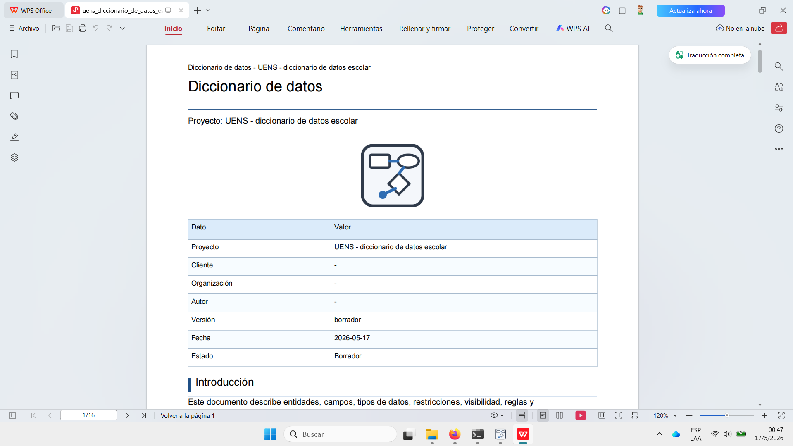
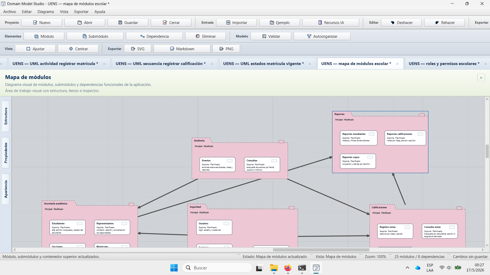
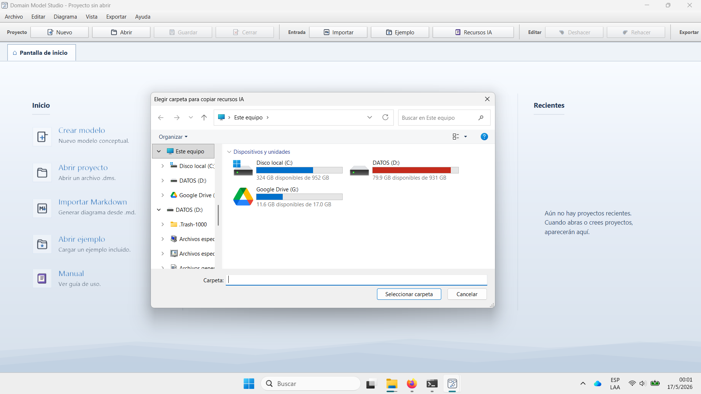

<p align="center">
  
</p>

<h1 align="center">Domain Model Studio</h1>

<p align="center">
  <strong>Convierte ideas de negocio, entrevistas y Markdown asistido por IA en modelos, diagramas, matrices, maquetas y documentos listos para conversar con clientes.</strong>
</p>

<p align="center">
  
  
  
  
</p>


> Ruta documental vigente: empezar por `docs/README.md`, `docs/documentacion/MAPA_DOCUMENTACION_VIVA.md`, `docs/desarrollo/ONBOARDING.md`, `docs/diagnostico/ESTADO_AUDITORIA_ACTUAL.md` y `scripts/README.md`.
> Regla documental desde Tanda 27: el repositorio conserva Markdown que explica capacidades vigentes, contratos, pruebas o fronteras actuales; la bitácora histórica de tandas pasadas se elimina salvo valor concreto de auditoría o compatibilidad.

---

## Una herramienta para pensar sistemas antes de programarlos

**Domain Model Studio** es una aplicación de escritorio para levantar, ordenar y comunicar sistemas administrativos. Su objetivo no es reemplazar a una herramienta profesional de UML, BPMN o diseño visual, sino ofrecer un flujo práctico para transformar una conversación con un cliente en artefactos comprensibles: modelos conceptuales, diccionarios de datos, procesos, arquitectura, permisos, pantallas y documentación exportable.

El valor comercial está en reducir la ambigüedad al inicio de un proyecto. Antes de escribir backend, frontend o base de datos, la aplicación ayuda a responder preguntas clave:

- qué entidades existen en el negocio;
- qué datos se deben registrar y validar;
- qué procesos sigue la operación real;
- qué módulos necesita el sistema;
- qué roles pueden hacer cada acción;
- qué pantallas administrativas harán falta;
- qué arquitectura mínima sostiene la solución.

> De una entrevista o Markdown a una propuesta visual y documental que se puede revisar, corregir, exportar y usar como base para desarrollo.

<p align="center">
  
</p>

---

## Por qué existe

En muchos proyectos pequeños y medianos el problema no empieza en el código: empieza en la falta de lenguaje común. El cliente habla de su operación diaria, el programador piensa en tablas y APIs, y el diseño termina apareciendo tarde, cuando ya hay decisiones difíciles de corregir.

Domain Model Studio propone una etapa intermedia: **modelar antes de construir**. Permite usar ejemplos oficiales, importar Markdown, editar visualmente, consultar teoría integrada y exportar documentos para revisión. Es especialmente útil para sistemas empresariales, administrativos, educativos, inventarios, atención al cliente, procesos internos y prototipos de software de negocio.

---

## Flujo de trabajo

```text
Entrevista / idea / Markdown
        ↓
Importación o ejemplo oficial
        ↓
Diagrama, matriz, documento o maqueta editable
        ↓
Revisión con guía académica integrada
        ↓
Exportación PNG, SVG vectorial documental, PDF o Markdown según el artefacto
        ↓
Material de análisis, venta, planificación o entrega técnica
```

<p align="center">
  
</p>

---

## Qué puede producir

| Familia | Artefactos principales | Uso práctico |
|---|---|---|
| Modelado de datos | Modelo conceptual, diccionario de datos | Entender entidades, atributos, reglas y campos antes de programar. |
| Procesos de negocio | BPMN básico, flujo operativo | Explicar cómo trabaja realmente una organización. |
| Arquitectura | C4 Contexto, C4 Contenedores, despliegue técnico | Comunicar límites del sistema, aplicaciones, servicios y ambientes. |
| UML | Clases, casos de uso, actividad, secuencia, estados | Revisar estructura, comportamiento e interacción del software. |
| Aplicaciones administrativas | Mapa de módulos, roles y permisos, flujo de pantallas, wireframes administrativos | Diseñar la experiencia operativa de una aplicación empresarial. |
| Levantamiento lógico | Expediente documental, grafo lógico, derivaciones, PDF/Markdown | Convertir entrevistas y Word asistido por IA en una fuente canónica revisable. |

---

## Levantamiento lógico como fuente canónica

El workspace `logical-business-intake` ordena entrevistas, observaciones y Markdown asistido por IA como expediente documental: secciones canónicas, elementos lógicos, entidades candidatas, preguntas pendientes, validación interna, impacto y dependencias. Su salida natural no es un canvas: es un documento revisable que luego puede derivar grafo lógico, diccionario de datos y otros insumos.

El PDF del levantamiento incluye portada, resumen, guía de códigos, índice navegable con hipervínculos internos, secciones completas, entidades candidatas y preguntas pendientes. El SideDock usa módulos operativos para estructura, ficha rápida, elementos lógicos, entidades, validación, impacto/dependencias, exportación y glosario.

---

## Guía académica integrada

La aplicación incluye una referencia académica integrada para estudiar cada tipo de artefacto sin salir del programa. Cada capítulo explica para qué sirve el diagrama, qué elementos usa, cómo se interpreta, cuándo conviene usarlo, qué errores comunes evitar y cómo se relaciona con los demás modelos.

Esto convierte a Domain Model Studio en una herramienta doble: sirve para **producir entregables** y también para **aprender a pensar sistemas** con criterio.

<p align="center">
  
</p>

---

## Diccionario de datos con salida documental

El diccionario de datos funciona como documento de precisión. Permite describir entidades, campos, tipos lógicos, reglas, restricciones, visibilidad, validaciones y observaciones. No es una tabla decorativa: es una pieza de comunicación entre negocio, análisis, backend, base de datos, frontend, pruebas y mantenimiento.

También puede exportarse como PDF o Markdown para entregar una versión formal del levantamiento de información. El PDF del diccionario incluye un índice navegable de estilo documental para saltar a resumen, tabla general y entidades.

<p align="center">
  
</p>

<p align="center">
  
</p>

---

## Diagramas visuales editables

Los diagramas visuales permiten mover elementos, revisar estructura, seleccionar, aplicar estilos por categoría, agregar comentarios visuales libres y exportar resultados. El enfoque es guiado por el tipo de artefacto: un mapa de módulos no se edita igual que un caso de uso, un despliegue técnico o un wireframe administrativo.

Los comentarios visuales son notas persistentes del canvas: no forman parte del modelo semántico, no entran en validaciones ni se exportan a Markdown/PDF documental, pero sí aparecen en PNG/SVG visual cuando ayudan a explicar una decisión.

<p align="center">
  
</p>

---


---

## UML Clases desde código fuente

El módulo de **UML Clases** permite crear un mapa visual de un proyecto Java o TypeScript a partir de una carpeta de código. La importación detecta raíces de código, clasifica módulos/carpetas, extrae clases, interfaces, enums, atributos, métodos y relaciones principales, y genera vistas internas para navegar sin depender siempre de una mega vista completa.

El diseño actual prioriza la estabilidad: el modelo conserva el detalle completo, pero el lienzo puede abrir una vista ligera para evitar saturar JavaFX con cientos de clases al mismo tiempo. El panel de propiedades permite revisar la información completa de la clase seleccionada, mientras que el canvas queda como mapa de orientación y navegación.

Capacidades principales:

- importación desde código Java y TypeScript;
- vistas internas como Resumen, Backend, Frontend, Integración API y Mega vista;
- perfiles visuales automáticos para mostrar menos miembros cuando el proyecto es grande;
- estimación de costo visual y memoria JVM para advertir vistas pesadas;
- búsqueda indexada por nombre, paquete, ruta, miembros y relaciones;
- render por lotes para reducir congelamientos en vistas grandes;
- exportación PNG/SVG protegida por vista activa;
- apertura del archivo fuente seleccionado desde un editor configurado en `Configuración > Editor de código...`.

Para proyectos grandes, la recomendación práctica es trabajar por vistas internas, módulos o filtros. La mega vista existe como referencia completa, pero no debería ser la forma normal de navegar sistemas con cientos de archivos.

## Recursos para trabajar con IA

Domain Model Studio puede copiar recursos de referencia para IA: gramáticas, ejemplos importables, reglas de formato y guías para generar Markdown compatible. Esto permite usar modelos generativos como apoyo en levantamiento, análisis y documentación, pero manteniendo una estructura verificable dentro de la aplicación.

<p align="center">
  
</p>

---

## Casos de uso comerciales

- Preparar una reunión con un posible cliente.
- Convertir una entrevista en módulos, procesos y datos.
- Explicar una propuesta de software administrativo.
- Generar documentación inicial para un MVP.
- Crear ejemplos base para una cartera de proyectos.
- Revisar si una idea de sistema tiene huecos antes de programar.
- Usar IA sin perder estructura ni trazabilidad humana.

---

## Requisitos

- Windows 10/11.
- JDK 21, recomendado Eclipse Temurin 21.
- Maven 3.9 o superior.
- JavaFX se resuelve por Maven.

---

## Ejecutar en desarrollo

Desde la raíz del proyecto:

```bat
scripts\00-verificar-entorno.bat
scripts\01-ejecutar-app.bat
```

Ejecutar pruebas:

```bat
scripts\02-ejecutar-tests.bat
```

Generar app-image validable con `jpackage`:

```bat
scripts\14-app-image-completa.bat
```

Generar instalador MSI completo:

```bat
scripts\15-msi-completo.bat
```

Preparar release candidate local completo:

```bat
scripts\16-release-candidate.bat
```

La app-image y el MSI dejan logs y manifiestos en `dist\logs`, `dist\staging`, `dist\installer` y `dist\release`. El MSI depende del soporte de `jpackage` para instaladores Windows y el cierre de RC requiere completar los reportes manuales de smoke en `docs/testeo/reportes/`.

---

## Estructura principal

```text
src/                         código Java y recursos de la aplicación
examples/                    ejemplos y plantillas importables
scripts/                     scripts operativos mínimos
readme-assets/               capturas usadas únicamente por este README
docs/                        documentación técnica, producto, testeo, release y diagnóstico vivo
```

---

## Estado del producto

El proyecto está en etapa de **MVP funcional avanzado / pre-RC local**. Ya permite abrir ejemplos, editar varios tipos de artefacto, consultar guía académica, exportar documentación y trabajar con un conjunto amplio de diagramas. El levantamiento lógico, el diccionario de datos, los índices PDF navegables, los comentarios visuales de canvas y el módulo de UML Clases forman parte de la superficie operativa vigente. Antes de tratarlo como release candidate, ejecutar la validación local Windows indicada en `scripts\16-release-candidate.bat` y completar los reportes de `docs/testeo/reportes/`.

---

## Autor

Mantenido bajo el identificador público **@programalobien** como herramienta de análisis, documentación y modelado para sistemas administrativos.


## Release candidate local

Para validar una versión candidata local en Windows, ejecutar:

```bat
scripts\02-ejecutar-tests.bat
scripts\13-revalidacion-local-completa.bat
scripts\14-app-image-completa.bat
scripts\15-msi-completo.bat
scripts\16-release-candidate.bat
```

El flujo final requiere tests verdes, revalidación local, app-image, MSI, smoke render automático y reporte manual del instalable Windows RC. El SVG se declara como vectorial documental, no como WYSIWYG universal.


## Auditoría documental e instalador

El README raíz es la entrada pública. El onboarding de desarrollo vive en `docs/desarrollo/ONBOARDING.md`, la superficie de comandos en `scripts/README.md` y el empaquetado Windows en `docs/desarrollo/EMPAQUETADO_WINDOWS.md` y `docs/tecnico/EMPAQUETADO_WINDOWS.md`. Para validar instalador no basta con generar el MSI: también se revisan manifiestos, logs y smoke manual del ejecutable instalado.
